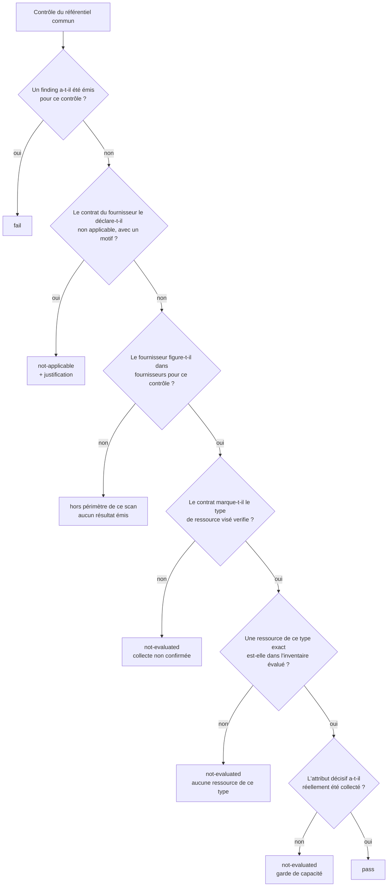

> [🇬🇧 English](assessment-model.md) · 🇫🇷 Français

# Le modèle d'assessment : `pass`, `fail`, `not-applicable`, `not-evaluated`

Un scanner de posture ne vaut que son affirmation la plus faible. Chez Pépin, l'affirmation la
plus faible est le `pass` : cette page porte donc surtout sur ce qui doit être vrai avant que
Pépin ait le droit de le prononcer.

Chaque scan produit un **assessment** : un résultat typé par contrôle, portant ses références
normatives exactes et la provenance du run. Il se lit avec `--format assessment`, ou scellé
dans un bundle `--seal`.

## Les quatre statuts, en une phrase chacun

| Statut | Ce que Pépin affirme |
|---|---|
| `pass` | *J'ai regardé, avec une donnée que je peux nommer, et je n'ai trouvé aucun écart.* |
| `fail` | *J'ai regardé et j'ai trouvé un écart, sur ce sujet, avec cette preuve.* |
| `not-applicable` | *Ce contrôle ne peut pas exister ici, et voici la justification consignée.* |
| `not-evaluated` | *Je n'ai pas pu décider, et voici exactement ce qui m'a manqué.* |

Il n'y a pas de cinquième statut, et surtout **pas de statut silencieux**. Un contrôle
implémenté pour le fournisseur scanné revient toujours avec l'un de ces quatre.

## La décision, exactement telle que le code la prend



Trois verrous séparent « aucun finding » de `pass`, et chacun existe parce que son absence a
produit un faux vert en conditions réelles.

## `pass`, et le verrou qui le garde

### Préconditions

Un `pass` exige **les quatre** conditions suivantes :

1. le fournisseur figure dans `fournisseurs` pour ce contrôle, dans
   `referentiel/controles.yaml` ;
2. le contrat du fournisseur (`providers/<nom>.yaml`, section `contrat.types`) marque le type
   de ressource visé `verifie`, c'est-à-dire que quelqu'un a lu le SDK et confirmé que la
   donnée est réellement collectée ;
3. l'inventaire évalué contient au moins une ressource du type **exact** que le contrôle lit
   (un contrôle `compute_image` n'est pas satisfait par la présence de `compute_instance`) ;
4. l'**attribut décisif** a réellement été collecté sur au moins une ressource de ce type.

### Pourquoi le quatrième verrou existe

La plupart des règles de Pépin portent une *garde de capacité* : elles ne se déclenchent que si
l'attribut qu'elles jugent est présent, pour qu'un fournisseur qui ne l'expose pas ne produise
aucun finding plutôt qu'une tempête de faux positifs. Cette garde est juste, et c'est aussi
exactement ce qui transforme « attribut jamais collecté » en « aucun finding », puis « aucun
finding » en faux `pass`.

`internal/assess` referme la brèche avec une table, `requiredAttr`, qui nomme l'attribut dont
la *présence* conditionne chacun de ces contrôles. Si aucun de ces attributs n'a été collecté
sur une ressource du type visé, le contrôle revient `not-evaluated`, jamais `pass`.

Le tableau ci-dessous est rendu depuis cette table même, il n'en est pas la copie :

<!-- pepin:gen required-attrs -->
| Contrôle | Type de ressource lu | Attribut décisif |
|---|---|---|
| `blockstorage_snapshot_not_public` | `blockstorage_snapshot` | `global_permission` |
| `blockstorage_volume_encryption` | `blockstorage_volume` | `encrypted` |
| `blockstorage_volume_snapshots_exist` | `blockstorage_volume` | `state` |
| `compute_image_not_public` | `compute_image` | `public` |
| `compute_instance_deletion_protection` | `compute_instance` | `deletion_protection` |
| `compute_instance_has_security_group` | `compute_instance` | `security_group_ids` |
| `compute_instance_no_secrets_in_user_data` | `compute_instance` | `user_data` |
| `compute_instance_public_ip_with_open_securitygroup` | `compute_instance` | `public_ip` |
| `database_backup_enabled` | `managed_database` | `disable_backup` |
| `database_encryption_at_rest_enabled` | `managed_database` | `encryption_at_rest` |
| `database_service_not_open_to_internet` | `managed_database` | `ip_filter` |
| `governance_resource_region_in_eu` | (aucun : contrôle transverse) | `region` |
| `iam_account_mfa_enforced` | `api_access_policy` | `require_trusted_env` |
| `iam_apiaccesspolicy_max_key_expiration` | `api_access_policy` | `max_access_key_expiration_seconds` |
| `iam_apiaccessrule_no_public_cidr` | `api_access_rule` | `ip_ranges` |
| `iam_no_root_access_key` | `access_key` | `root_owned` ou `scope` |
| `iam_policy_no_administrative_privileges` | `iam_policy` | `statements` |
| `iam_policy_no_notaction_notresource` | `iam_policy` | `statements` |
| `iam_policy_no_privilege_escalation` | `iam_policy` | `manages_iam` ou `statements` |
| `iam_policy_no_wildcard_resource` | `iam_policy` | `statements` |
| `iam_role_key_lifetime_bounded` | `iam_role` | `max_session_ttl` ou `policy_has_expiration` |
| `iam_role_no_admin_privileges` | `iam_role` | `admin_privileges` |
| `iam_role_source_ip_restricted` | `iam_role` | `source_ip_restricted` |
| `iam_user_mfa_enabled` | `iam_user` | `mfa_enabled` |
| `kubernetes_cluster_audit_logging_enabled` | `kubernetes_cluster` | `audit_enabled` |
| `kubernetes_cluster_auto_upgrade_enabled` | `kubernetes_cluster` | `auto_upgrade` |
| `kubernetes_cluster_control_plane_highly_available` | `kubernetes_cluster` | `control_plane_multi_az` |
| `kubernetes_cluster_deletion_protection` | `kubernetes_cluster` | `deletion_protection` |
| `kubernetes_cluster_not_publicly_accessible` | `kubernetes_cluster` | `admin_whitelist` |
| `loadbalancer_http_redirect_to_https` | `load_balancer` | `redirect_to_https` |
| `loadbalancer_ssl_listeners` | `load_balancer` | `load_balancer_type` |
| `network_flow_matrix_documented` | `security_group_rule` | `description` |
| `network_peering_cross_organization` | `network_peering` | `accepter_account` ou `source_account` |
| `network_securitygroup_default_deny` | `security_group` | `inbound_default_policy` |
| `network_securitygroup_default_restrict_traffic` | `security_group_rule` | `security_group_name` |
| `network_subnet_no_public_ip_by_default` | `subnet` | `map_public_ip_on_launch` |
| `objectstorage_bucket_default_encryption` | `object_storage_bucket` | `default_encryption_enabled` |
| `objectstorage_bucket_kms_encryption` | `object_storage_bucket` | `sse_kms_enabled` |
| `objectstorage_bucket_object_lock_enabled` | `object_storage_bucket` | `object_lock_enabled` |
| `objectstorage_bucket_public_access` | `object_storage_bucket` | `acl` ou `acl_grants` ou `public_via_acl` |
| `objectstorage_bucket_versioning_enabled` | `object_storage_bucket` | `versioning` |
<!-- /pepin:gen required-attrs -->

Deux entrées méritent une seconde lecture :

- `objectstorage_bucket_public_access` n'accepte que des signaux d'**ACL**. `policy_public` en
  faisait partie, or l'ACL et la policy du bucket sont interrogées par deux appels distincts,
  au mieux : un `403` sur `GetBucketAcl` suivi d'un `GetBucketPolicy` réussi laissait
  `policy_public: false` seul dans l'inventaire, franchissait le verrou et concluait
  « conforme » sur une ACL jamais lue.
- Les contrôles de politique IAM exigent `statements`, et une *collection vide ne compte pas
  comme collectée*. Le collecteur pose toujours `statements`, au besoin à `[]` quand le
  document n'a pas pu être analysé ; sans cette règle, quatre contrôles `critical`/`high`
  concluaient « conforme » sur zéro information.

### À quoi ressemble un `pass`

<!-- pepin:gen assessment-pass -->
```json
{
  "control": "network_securitygroup_allow_ingress_from_internet_to_all_ports",
  "evidence": {
    "observed": "aucune non-conformité détectée sur les ressources de type « security_group_rule » collectées (contrat vérifié)",
    "proves": [
      "",
      "",
      ""
    ],
    "source": "terraform-plan"
  },
  "references": [
    {
      "framework": "scsl",
      "id": "CLD-NET-2"
    },
    {
      "framework": "cis-v8",
      "id": "4.4"
    },
    {
      "framework": "cis-v8",
      "id": "12.2"
    },
    {
      "framework": "iso-27001",
      "id": "A.8.20"
    },
    {
      "framework": "iso-27001",
      "id": "A.8.22"
    },
    {
      "framework": "secnumcloud-3.2",
      "id": "13.2"
    }
  ],
  "severity": "critical",
  "status": "pass",
  "subject": "scaleway",
  "title": "Tout le trafic entrant autorisé depuis Internet (any/any)"
}
```
<!-- /pepin:gen assessment-pass -->

Regardez `evidence.observed` : un `pass` dit **ce qui a été vérifié**, pas seulement que rien
n'a été trouvé. Cette phrase est toute la différence entre une affirmation et une absence.

### Différence avec « aucun finding »

« Aucun finding » est une propriété du moteur de règles : aucune règle n'a produit de sortie.
`pass` est une propriété de l'assessment : une règle qui *aurait pu* produire une sortie n'en a
pas produit. La première est compatible avec n'avoir rien collecté du tout ; la seconde, non.

## `fail`

### Préconditions

Une règle a émis un finding. Un résultat `fail` est produit **par finding** : un contrôle en
écart sur trois sujets rend donc trois résultats. Un assessment est une liste de faits sur des
ressources, pas une liste à cocher de contrôles.

<!-- pepin:gen assessment-fail -->
```json
{
  "control": "objectstorage_bucket_public_access",
  "evidence": {
    "observed": "Bucket « scaleway_object_bucket_acl.backups » accessible publiquement (ACL publique).",
    "proves": [
      "",
      "",
      ""
    ],
    "source": "terraform-plan"
  },
  "labels": {
    "category": "security",
    "provider": "scaleway"
  },
  "references": [
    {
      "framework": "scsl",
      "id": "CLD-STO-1"
    },
    {
      "framework": "cis-v8",
      "id": "3.3"
    },
    {
      "framework": "iso-27001",
      "id": "A.5.15"
    },
    {
      "framework": "iso-27001",
      "id": "A.8.3"
    },
    {
      "framework": "iso-27017",
      "id": "CLD.9.5.1"
    },
    {
      "framework": "secnumcloud-3.2",
      "id": "9.7"
    },
    {
      "framework": "secnumcloud-3.2",
      "id": "13.2"
    }
  ],
  "remediation": "Rendre le bucket privé (ACL private, retrait du grant AllUsers, suppression de la policy publique) ; servir via des URLs pré-signées si nécessaire.",
  "severity": "critical",
  "status": "fail",
  "subject": "scaleway_object_bucket_acl.backups",
  "title": "Stockage objet exposé publiquement"
}
```
<!-- /pepin:gen assessment-fail -->

`evidence.observed` reprend le message du finding, préfixe du sujet retiré ; `subject` nomme la
ressource fautive ; `remediation` donne le geste correctif. `references` porte les
correspondances normatives exactes, ce qui rend le résultat exploitable en audit.

### Conséquence

Au moins un écart `critical` ou `high` fait sortir le run en `1`. Les écarts `medium` et `low`
ne le font pas, sauf avec `--strict`.

## `not-applicable`

### Préconditions

Le contrat du fournisseur déclare le contrôle non testable **avec une justification** : soit une
entrée explicite `contrat.non_applicable`, soit un type de ressource visé marqué `etat: absent`.
Sans justification, Pépin ne marque pas un contrôle non applicable : un N/A non justifié est
rejeté par n'importe quel auditeur, l'outil refuse donc d'en produire.

<!-- pepin:gen assessment-na -->
```json
{
  "control": "blockstorage_volume_encryption",
  "references": [
    {
      "framework": "scsl",
      "id": "CLD-CHF-2"
    },
    {
      "framework": "iso-27001",
      "id": "A.8.24"
    },
    {
      "framework": "secnumcloud-3.2",
      "id": "10.1"
    }
  ],
  "severity": "high",
  "status": "not-applicable",
  "subject": "scaleway",
  "title": "Chiffrement au repos désactivé",
  "waiver": {
    "justification": "Chiffrement au repos des volumes block côté invité (LUKS/Cryptsetup), responsabilité du client (responsabilité partagée) ; l'API block n'expose aucun champ de chiffrement → non observable côté plateforme (CHF-2)."
  }
}
```
<!-- /pepin:gen assessment-na -->

Le motif voyage dans `waiver.justification`, cité mot pour mot depuis le contrat.

### Conséquence

Ce n'est ni un écart, ni une conformité. C'est une absence de sujet, documentée.

## `not-evaluated`

### Préconditions

L'une des trois : le contrat ne confirme pas la collecte de la donnée ; aucune ressource du type
visé n'est dans le périmètre ; ou l'attribut décisif n'a pas été collecté. Le résultat dit
toujours laquelle.

<!-- pepin:gen assessment-ne -->
```json
{
  "control": "compute_instance_public_ip_with_open_securitygroup",
  "evidence": {
    "observed": "attribut « public_ip » non collecté sur les ressources de type « compute_instance » (garde de capacité)",
    "proves": [
      "",
      "",
      ""
    ],
    "source": "terraform-plan"
  },
  "references": [
    {
      "framework": "scsl",
      "id": "CLD-NET-3"
    },
    {
      "framework": "cis-v8",
      "id": "4.4"
    },
    {
      "framework": "cis-v8",
      "id": "12.2"
    },
    {
      "framework": "iso-27001",
      "id": "A.8.20"
    },
    {
      "framework": "iso-27001",
      "id": "A.8.22"
    },
    {
      "framework": "iso-27017",
      "id": "CLD.9.5.2"
    },
    {
      "framework": "secnumcloud-3.2",
      "id": "13.2"
    }
  ],
  "severity": "critical",
  "status": "not-evaluated",
  "subject": "scaleway",
  "title": "Machine exposée publiquement sans filtrage restrictif"
}
```
<!-- /pepin:gen assessment-ne -->

Sur le scan de `examples/scaleway/terraform/plan.json` utilisé dans le parcours de démarrage,
voici les motifs distincts observés :

<!-- pepin:gen not-evaluated-reasons -->
| Motif | Nombre | Contrôle témoin |
|---|---:|---|
| attribut « … » non collecté sur les ressources collectées (garde de capacité) | 1 | `governance_resource_region_in_eu` |
| attribut « … » non collecté sur les ressources de type « … » (garde de capacité) | 3 | `compute_instance_public_ip_with_open_securitygroup` |
| aucune ressource de type « … » dans l'inventaire évalué | 3 | `iam_accesskey_expiration_set` |
| collecte de la donnée nécessaire non confirmée pour ce fournisseur (contrat non « … ») | 1 | `network_documented` |
<!-- /pepin:gen not-evaluated-reasons -->

### Un `not-evaluated` n'est jamais une conformité

C'est la réponse honnête à une question qui n'a pas pu être posée. Le compter comme un `pass`
convertirait chaque échec de collecte en feu vert : identifiants expirés, rôle en lecture seule
à qui il manque une permission, région non scannée. Le compter comme un `fail` serait tout
aussi faux : rien n'a été observé de cassé non plus.

Si vous voulez une porte qui refuse l'incertitude, utilisez `--strict` et lisez les codes de
sortie ci-dessous.

## Les scénarios, rangés

| Scénario | Statut | D'où vient le motif |
|---|---|---|
| Ressource réellement conforme | `pass` | règle silencieuse, les quatre verrous levés |
| Ressource non conforme | `fail` | la règle a émis un finding |
| Service inexistant chez ce fournisseur | `not-applicable` | `contrat.non_applicable`, ou type `etat: absent` |
| API injoignable, droits insuffisants | `not-evaluated` | attribut absent, garde de capacité |
| Attribut non exposé par la source | `not-evaluated` | attribut décisif non projeté par cette source |
| Inventaire vide | `not-evaluated` pour tous les contrôles | aucune ressource d'aucun type visé |
| Donnée partiellement collectée | `pass`/`fail` sur ce qui a été collecté, `not-evaluated` sur le reste | par contrôle et par attribut |

La dernière ligne est la plus importante : la granularité est le **contrôle**, pas le run. Un
scan n'est jamais globalement « fiable » ou non, chaque contrôle porte sa propre réponse.

## Répartition des statuts sur un scan réel

Le scan du plan volontairement non conforme du
[démarrage rapide](../getting-started/quickstart.fr.md) produit les quatre statuts à la fois :

<!-- pepin:gen assessment-counts -->
| Statut | Nombre |
|---|---:|
| `pass` | 6 |
| `fail` | 11 |
| `not-applicable` | 2 |
| `not-evaluated` | 8 |
<!-- /pepin:gen assessment-counts -->

## Le lien avec le code de sortie `3`

Un run dont l'assessment ne contient **aucun** `pass` ni **aucun** `fail` hors gouvernance n'a
rien mesuré. Pépin rend **3** dans ce cas, et le fait **sans exiger `--strict`** :

<!-- pepin:gen exit-codes -->
| Situation | Commande | Code de sortie |
|---|---|:-:|
| Aucun écart sur le périmètre évalué | `./pepin scan scaleway --terraform examples/scaleway/terraform-fixed/plan.json` | **0** |
| Au moins un écart critical ou high | `./pepin scan scaleway --terraform examples/scaleway/terraform/plan.json` | **1** |
| Erreur technique (fichier illisible, provider inconnu, API injoignable) | `./pepin scan scaleway examples/scaleway/plan-absent.json` | **2** |
| Rien n'a été mesuré (inventaire vide) : **sans avoir à demander `--strict`** | `./pepin scan scaleway empty-inventory.json` | **3** |
| Écarts medium/low seulement, sans `--strict` | `./pepin scan scaleway tagless-inventory.json` | **0** |
| Écarts medium/low seulement, avec `--strict` | `./pepin scan scaleway tagless-inventory.json --strict` | **3** |
<!-- /pepin:gen exit-codes -->

Les contrôles de gouvernance sont exclus de ce décompte à dessein.
`governance_provider_sovereignty` passe sur des faits déclarés au descripteur du fournisseur,
pas sur quoi que ce soit de mesuré dans votre tenant ; le compter permettrait à un tenant vidé
de toutes ses ressources de se déclarer conforme.

Le bandeau du terminal le dit avant le code de sortie : `Verdict : INDÉTERMINÉ`.

## Voir aussi

- [Matrice de couverture](../coverage.fr.md) : quels contrôles peuvent atteindre `pass`, par
  fournisseur et par source.
- [Limites connues](../known-limitations.fr.md), dont les contrôles qui ne peuvent aujourd'hui
  jamais atteindre `pass`.
- [Lire un scan](../getting-started/understanding-a-scan.fr.md) : le même document, lu à travers
  le rapport du terminal.
