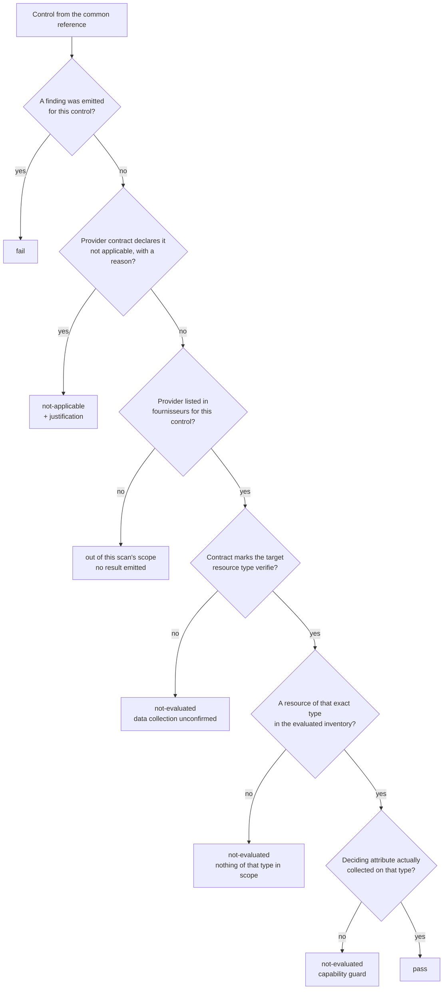

> 🇬🇧 English · [🇫🇷 Français](assessment-model.fr.md)

# The assessment model — `pass`, `fail`, `not-applicable`, `not-evaluated`, `exempted`

A posture scanner is only worth its weakest claim. Pépin's weakest claim is `pass`, so this
page is mostly about what has to be true before Pépin is allowed to say it.

Every scan produces one **assessment**: one typed result per control, each carrying its exact
normative references and the provenance of the run. Read it with `--format assessment`, or
find it sealed inside a `--seal` bundle.

The captured output on this page is in French: the CLI, the reference and the rules are French
by repository convention, and quoting them verbatim is the only way this page can be checked
against what the tool prints.

## The five statuses in one sentence each

| Status | Pépin asserts |
|---|---|
| `pass` | *I looked at this, with data I can name, and found no deviation.* |
| `fail` | *I looked at this and found a deviation, on this subject, with this evidence.* |
| `not-applicable` | *This control cannot exist here, and here is the recorded justification.* |
| `not-evaluated` | *I could not decide, and here is exactly what I was missing.* |
| `exempted` | *I found a deviation, and someone accepted it — here is who, why and until when.* |

The first four are what Pépin **measures**; the fifth is what an organization **decides**, and
it is never a compliance. There is no sixth status, and in particular **no silent one**: a
control implemented for the scanned provider always comes back with one of these five.

## The decision, exactly as the code takes it



Three gates stand between "no finding" and `pass`, and each one exists because removing it
produced a false green in practice.

## `pass` — and the lock that guards it

### Precondition

A `pass` requires **all four** of:

1. the provider is listed in `fournisseurs` for that control in `referentiel/controles.yaml`;
2. the provider contract (`providers/<name>.yaml`, section `contrat.types`) marks the target
   resource type `verifie` — that is, someone read the SDK and confirmed the data is really
   collected;
3. the evaluated inventory contains at least one resource of the **exact** type the control
   reads (a `compute_image` control is not satisfied by the presence of `compute_instance`);
4. the **deciding attribute** was actually collected on at least one resource of that type.

### Why gate 4 exists

Most Pépin rules carry a *capability guard*: they only fire when the attribute they judge is
present, so that a provider which does not expose it produces no finding rather than a storm
of false positives. That guard is correct — and it is also exactly what turns "attribute never
collected" into "no finding", and "no finding" into a false `pass`.

`internal/assess` closes the hole with a table, `requiredAttr`, that names the attribute whose
*presence* each such control depends on. If none of those attributes was collected on any
resource of the type, the control comes back `not-evaluated`, never `pass`.

The table below is rendered from that very map — not transcribed from it:

<!-- pepin:gen required-attrs -->
| Control | Resource type read | Deciding attribute |
|---|---|---|
| `blockstorage_snapshot_not_public` | `blockstorage_snapshot` | `global_permission` |
| `blockstorage_volume_encryption` | `blockstorage_volume` | `encrypted` |
| `blockstorage_volume_snapshots_exist` | `blockstorage_volume` | `state` |
| `compute_image_not_public` | `compute_image` | `public` |
| `compute_instance_deletion_protection` | `compute_instance` | `deletion_protection` |
| `compute_instance_has_security_group` | `compute_instance` | `security_group_ids` |
| `compute_instance_no_secrets_in_user_data` | `compute_instance` | `user_data` |
| `compute_instance_public_ip_with_open_securitygroup` | `compute_instance` | `public_ip` |
| `database_backup_enabled` | `managed_database` | `disable_backup` |
| `database_encryption_at_rest_enabled` | `managed_database` | `encryption_at_rest` |
| `database_service_not_open_to_internet` | `managed_database` | `ip_filter` |
| `governance_resource_region_in_eu` | (none: cross-cutting control) | `region` |
| `iam_account_mfa_enforced` | `api_access_policy` | `require_trusted_env` |
| `iam_apiaccesspolicy_max_key_expiration` | `api_access_policy` | `max_access_key_expiration_seconds` |
| `iam_apiaccessrule_no_public_cidr` | `api_access_rule` | `ip_ranges` |
| `iam_no_root_access_key` | `access_key` | `root_owned` or `scope` |
| `iam_policy_no_administrative_privileges` | `iam_policy` | `statements` |
| `iam_policy_no_notaction_notresource` | `iam_policy` | `statements` |
| `iam_policy_no_privilege_escalation` | `iam_policy` | `manages_iam` or `statements` |
| `iam_policy_no_wildcard_resource` | `iam_policy` | `statements` |
| `iam_role_key_lifetime_bounded` | `iam_role` | `max_session_ttl` or `policy_has_expiration` |
| `iam_role_no_admin_privileges` | `iam_role` | `admin_privileges` |
| `iam_role_source_ip_restricted` | `iam_role` | `source_ip_restricted` |
| `iam_user_mfa_enabled` | `iam_user` | `mfa_enabled` |
| `kubernetes_cluster_audit_logging_enabled` | `kubernetes_cluster` | `audit_enabled` |
| `kubernetes_cluster_auto_upgrade_enabled` | `kubernetes_cluster` | `auto_upgrade` |
| `kubernetes_cluster_control_plane_highly_available` | `kubernetes_cluster` | `control_plane_multi_az` |
| `kubernetes_cluster_deletion_protection` | `kubernetes_cluster` | `deletion_protection` |
| `kubernetes_cluster_not_publicly_accessible` | `kubernetes_cluster` | `admin_whitelist` |
| `loadbalancer_http_redirect_to_https` | `load_balancer` | `redirect_to_https` |
| `loadbalancer_ssl_listeners` | `load_balancer` | `load_balancer_type` |
| `network_documented` | `network` | `tags` |
| `network_flow_matrix_documented` | `security_group_rule` | `description` |
| `network_peering_cross_organization` | `network_peering` | `accepter_account` or `source_account` |
| `network_securitygroup_default_deny` | `security_group` | `inbound_default_policy` |
| `network_securitygroup_default_restrict_traffic` | `security_group_rule` | `security_group_name` |
| `network_subnet_no_public_ip_by_default` | `subnet` | `map_public_ip_on_launch` |
| `objectstorage_bucket_default_encryption` | `object_storage_bucket` | `default_encryption_enabled` |
| `objectstorage_bucket_kms_encryption` | `object_storage_bucket` | `sse_kms_enabled` |
| `objectstorage_bucket_object_lock_enabled` | `object_storage_bucket` | `object_lock_enabled` |
| `objectstorage_bucket_public_access` | `object_storage_bucket` | `acl` or `acl_grants` or `public_via_acl` |
| `objectstorage_bucket_versioning_enabled` | `object_storage_bucket` | `versioning` |
<!-- /pepin:gen required-attrs -->

Two entries are worth reading twice:

- `objectstorage_bucket_public_access` accepts only **ACL** signals. `policy_public` used to be
  in the list, and the bucket ACL and the bucket policy are fetched by two separate,
  best-effort calls: a `403` on `GetBucketAcl` followed by a successful `GetBucketPolicy` left
  `policy_public: false` alone in the inventory, cleared the gate, and concluded "compliant"
  about an ACL that was never read.
- The IAM policy controls require `statements`, and an *empty collection does not count as
  collected*. The collector always sets `statements`, falling back to `[]` when the document
  could not be parsed; without that rule, four `critical`/`high` controls concluded "compliant"
  on zero information.

### What a `pass` looks like

<!-- pepin:gen assessment-pass -->
```json
{
  "control": "network_securitygroup_allow_ingress_from_internet_to_all_ports",
  "evidence": {
    "observed": "no deviation detected on the collected resources of type \"security_group_rule\" (contract verified)",
    "proves": [
      "",
      "",
      ""
    ],
    "source": "terraform-plan"
  },
  "references": [
    {
      "framework": "scsl",
      "id": "CLD-NET-2"
    },
    {
      "framework": "cis-v8",
      "id": "4.4"
    },
    {
      "framework": "cis-v8",
      "id": "12.2"
    },
    {
      "framework": "iso-27001",
      "id": "A.8.20"
    },
    {
      "framework": "iso-27001",
      "id": "A.8.22"
    },
    {
      "framework": "secnumcloud-3.2",
      "id": "13.2"
    }
  ],
  "severity": "critical",
  "status": "pass",
  "subject": "scaleway",
  "title": "All inbound traffic allowed from the internet (any/any)"
}
```
<!-- /pepin:gen assessment-pass -->

Note `evidence.observed`: a `pass` states **what was checked**, not merely that nothing was
found. That sentence is the difference between an assertion and an absence.

### Difference from "no finding"

"No finding" is a property of the rule engine: no rule produced output. `pass` is a property of
the assessment: a rule that *could* have produced output did not. The first is compatible with
having collected nothing at all; the second is not.

## `fail`

### Precondition

A rule emitted a finding. One `fail` result is produced **per finding**, so a control that
fails on three subjects yields three results — an assessment is a list of facts about
resources, not a checklist of controls.

<!-- pepin:gen assessment-fail -->
```json
{
  "control": "objectstorage_bucket_public_access",
  "evidence": {
    "attribute": "acl",
    "observed": "Bucket \"scaleway_object_bucket_acl.backups\" is publicly accessible (public ACL).",
    "proves": [
      "",
      "",
      ""
    ],
    "source": "acl=terraform-plan:scaleway_object_bucket + terraform-plan:scaleway_object_bucket_acl observed=2/2"
  },
  "labels": {
    "category": "security",
    "provider": "scaleway",
    "tf_file": "main.tf",
    "tf_line": "81"
  },
  "references": [
    {
      "framework": "scsl",
      "id": "CLD-STO-1"
    },
    {
      "framework": "cis-v8",
      "id": "3.3"
    },
    {
      "framework": "iso-27001",
      "id": "A.5.15"
    },
    {
      "framework": "iso-27001",
      "id": "A.8.3"
    },
    {
      "framework": "iso-27017",
      "id": "CLD.9.5.1"
    },
    {
      "framework": "secnumcloud-3.2",
      "id": "9.7"
    },
    {
      "framework": "secnumcloud-3.2",
      "id": "13.2"
    }
  ],
  "remediation": "Make the bucket private (private ACL, remove the AllUsers grant, delete the public policy); serve through pre-signed URLs if needed.",
  "severity": "critical",
  "status": "fail",
  "subject": "scaleway_object_bucket_acl.backups",
  "title": "Object storage publicly exposed"
}
```
<!-- /pepin:gen assessment-fail -->

`evidence.observed` is the finding's message with the subject prefix stripped; `subject` names
the offending resource; `remediation` is the actionable fix. `references` carries the exact
normative mappings, which is what makes the result usable in an audit.

### Consequence

At least one `critical` or `high` deviation makes the run exit `1`. `medium` and `low`
deviations do not, unless you ask for `--strict`.

## `not-applicable`

### Precondition

The provider contract declares the control untestable **with a justification**: either an
explicit `contrat.non_applicable` entry, or a target resource type marked `etat: absent`.
Without a justification, Pépin does not mark a control not-applicable — an unjustified N/A is
rejected by any auditor, so the tool refuses to produce one.

<!-- pepin:gen assessment-na -->
```json
{
  "control": "blockstorage_volume_encryption",
  "references": [
    {
      "framework": "scsl",
      "id": "CLD-CHF-2"
    },
    {
      "framework": "iso-27001",
      "id": "A.8.24"
    },
    {
      "framework": "secnumcloud-3.2",
      "id": "10.1"
    }
  ],
  "severity": "high",
  "status": "not-applicable",
  "subject": "scaleway",
  "title": "Encryption at rest disabled",
  "waiver": {
    "justification": "Encryption at rest of block volumes is guest-side (LUKS/Cryptsetup), a customer responsibility (shared responsibility model); the block API exposes no encryption field, hence unobservable on the platform side (CHF-2)."
  }
}
```
<!-- /pepin:gen assessment-na -->

The reason travels in `waiver.justification`, quoted verbatim from the contract.

### Consequence

Not a deviation, and not a compliance either. It is a documented absence of subject.

## `not-evaluated`

### Precondition

Any of: the contract does not confirm the data is collected; no resource of the target type is
in scope; or the deciding attribute was not collected. The result always says which.

<!-- pepin:gen assessment-ne -->
```json
{
  "control": "compute_instance_public_ip_with_open_securitygroup",
  "evidence": {
    "observed": "attribute \"public_ip\" not collected on the resources of type \"compute_instance\" (capability guard)",
    "proves": [
      "",
      "",
      ""
    ],
    "source": "terraform-plan"
  },
  "references": [
    {
      "framework": "scsl",
      "id": "CLD-NET-3"
    },
    {
      "framework": "cis-v8",
      "id": "4.4"
    },
    {
      "framework": "cis-v8",
      "id": "12.2"
    },
    {
      "framework": "iso-27001",
      "id": "A.8.20"
    },
    {
      "framework": "iso-27001",
      "id": "A.8.22"
    },
    {
      "framework": "iso-27017",
      "id": "CLD.9.5.2"
    },
    {
      "framework": "secnumcloud-3.2",
      "id": "13.2"
    }
  ],
  "severity": "critical",
  "status": "not-evaluated",
  "subject": "scaleway",
  "title": "Instance publicly exposed without restrictive filtering"
}
```
<!-- /pepin:gen assessment-ne -->

On the walkthrough scan of `examples/scaleway/terraform/plan.json`, these are the distinct
reasons observed:

<!-- pepin:gen not-evaluated-reasons -->
| Reason | Count | Witness control |
|---|---:|---|
| attribute "…" not collected on the collected resources (capability guard) | 1 | `governance_resource_region_in_eu` |
| attribute "…" not collected on the resources of type "…" (capability guard) | 4 | `compute_instance_has_security_group` |
| collection of the required data is not confirmed for this provider (contract not "…") | 1 | `network_documented` |
| no resource of type "…" in the assessed inventory | 3 | `iam_accesskey_expiration_set` |
<!-- /pepin:gen not-evaluated-reasons -->

### `not-evaluated` is never a compliance

It is the honest answer to a question that could not be asked. Treating it as a `pass` would
convert every collection failure into a green light — expired credentials, a read-only role
missing one permission, a region that was not scanned. Treating it as a `fail` would be equally
wrong: nothing was observed to be broken either.

If you need a gate that refuses uncertainty, use `--strict`, and read the exit codes below.

## `exempted` — set aside, never compliant

The four statuses above are what Pépin *measures*. `exempted` is what an organization
*decides*: this control fails, someone accepts the risk, here is who, why and until when.

A CSPM used in production has to allow exceptions. Without them, a team disables the control,
or stops reading the tool — both worse than the deviation. What a CSPM must never allow is the
silent form of it (`ignore: true`), which is a false green under another name.

### Precondition

A `fail` result whose `(control, subject)` is covered by a **valid** entry of the exemptions
file passed to `scan --exceptions`. Valid means all five mandatory fields are present and the
expiry date has not passed at the instant of evaluation.

Only a `fail` can become `exempted`. A `not-evaluated` cannot: waiving a control nobody managed
to measure would hide a missing measurement behind an exception, which is the same false green
with one more step.

### What it looks like

<!-- pepin:gen assessment-exempted -->
```json
{
  "control": "network_securitygroup_allow_ingress_from_internet_to_tcp_port_22",
  "evidence": {
    "observed": "Security group \"sg-bastion\": SSH (port 22) accepted from/to the internet.",
    "proves": [
      "",
      "",
      ""
    ],
    "source": "export"
  },
  "labels": {
    "category": "security",
    "exemption_approved_by": "security@example.org",
    "exemption_expires_at": "2099-12-31",
    "exemption_owner": "platform-security",
    "provider": "scaleway"
  },
  "references": [
    {
      "framework": "scsl",
      "id": "CLD-NET-1"
    },
    {
      "framework": "scsl",
      "id": "CLD-IAM-6"
    },
    {
      "framework": "scsl",
      "id": "CLD-NET-6"
    },
    {
      "framework": "cis-v8",
      "id": "4.4"
    },
    {
      "framework": "cis-v8",
      "id": "12.2"
    },
    {
      "framework": "iso-27001",
      "id": "A.8.20"
    },
    {
      "framework": "iso-27001",
      "id": "A.8.22"
    },
    {
      "framework": "secnumcloud-3.2",
      "id": "13.2"
    }
  ],
  "remediation": "Restrict the rule to legitimate sources/destinations and ports (administration CIDR, bastion, VPN); never expose a sensitive service to 0.0.0.0/0.",
  "severity": "high",
  "status": "exempted",
  "subject": "sg-bastion",
  "title": "SSH (port 22) open to the internet",
  "waiver": {
    "justification": "Bastion administre, acces restreint par IP source en amont",
    "until": "2099-12-31"
  }
}
```
<!-- /pepin:gen assessment-exempted -->

The waiver travels with the result — justification, expiry, owner and approver — because a
dossier that does not say what it set aside, and on whose authority, is not defensible.

### Consequence

`exempted` is a first-class status, and distinct from `pass` everywhere:

- **In the assessment**, the status string is `exempted`; the OSCAL rendering treats it, like
  every non-`pass` status, as `not-satisfied`.
- **In the report**, nothing disappears. The finding stays in `--format json`, in the SARIF and
  in the severity counts; `summary.conforme` stays false. An exemption removes a deviation from
  the **gate**, never from the record.
- **In the terminal**, an `EXEMPTIONS APPLIED — accepted deviations, NOT compliant` block lists
  each one with its owner, its approver and its date. A discreet exemption is an exemption
  nobody reviews.
- **In the verdict**, the headline reads `NON-COMPLIANT under waiver`. It never reads
  compliant.
- **In the exit code**, a dedicated **4** — see [exit codes](../reference/exit-codes.md).

An expired exemption stops applying and says so; one naming a control or a subject that does
not exist is reported as an orphan. Both are printed on standard error, and both fail a
`--strict` gate.

## The scenarios, mapped

| Scenario | Status | Where the reason comes from |
|---|---|---|
| Resource genuinely compliant | `pass` | rule silent, all four gates cleared |
| Resource non-compliant | `fail` | rule emitted a finding |
| Service does not exist at this provider | `not-applicable` | `contrat.non_applicable`, or type `etat: absent` |
| API unreachable / insufficient rights | `not-evaluated` | attribute absent → capability guard |
| Attribute not exposed by the source | `not-evaluated` | deciding attribute not projected by that source |
| Empty inventory | `not-evaluated` for every control | no resource of any target type |
| Partially collected data | `pass`/`fail` on what was collected, `not-evaluated` on the rest | per-control, per-attribute |

The last row is the important one: the granularity is the **control**, not the run. A scan is
never globally "trustworthy" or not — each control carries its own answer.

## Status counts on a real scan

Scanning the deliberately misconfigured plan of the
[quickstart](../getting-started/quickstart.md) yields the four measured statuses at once
(`exempted` appears only when an exemptions file is supplied):

<!-- pepin:gen assessment-counts -->
| Status | Count |
|---|---:|
| `pass` | 6 |
| `fail` | 10 |
| `not-applicable` | 2 |
| `not-evaluated` | 9 |
<!-- /pepin:gen assessment-counts -->

## The link with exit code `3`

A run whose assessment contains **no** `pass` and **no** `fail` outside governance controls
measured nothing. Pépin returns **3** for it, and does so **without requiring `--strict`**:

<!-- pepin:gen exit-codes -->
| Situation | Command | Exit code |
|---|---|:-:|
| No deviation in the evaluated scope | `./pepin scan scaleway --terraform examples/scaleway/terraform-fixed/plan.json` | **0** |
| At least one critical or high deviation | `./pepin scan scaleway --terraform examples/scaleway/terraform/plan.json` | **1** |
| Technical error (unreadable file, unknown provider, unreachable API) | `./pepin scan scaleway examples/scaleway/plan-absent.json` | **2** |
| Nothing was measured (empty inventory): **without having to ask for `--strict`** | `./pepin scan scaleway empty-inventory.json` | **3** |
| Medium/low deviations only, without `--strict` | `./pepin scan scaleway tagless-inventory.json` | **0** |
| Medium/low deviations only, with `--strict` | `./pepin scan scaleway tagless-inventory.json --strict` | **3** |
| No deviation, but one collection unit could not be read | `./pepin scan scaleway partial-inventory.json` | **3** |
| Every critical/high deviation is covered by a valid exemption | `./pepin scan scaleway bastion-inventory.json --exceptions exceptions.yaml` | **4** |
| The same exemption, lapsed: it no longer applies | `./pepin scan scaleway bastion-inventory.json --exceptions exceptions-expired.yaml` | **1** |
<!-- /pepin:gen exit-codes -->

Governance controls are excluded from that count on purpose. `governance_provider_sovereignty`
passes on facts declared in the provider descriptor, not on anything measured in your tenant;
counting it would let a tenant emptied of all its resources report itself compliant.

The terminal banner says the same thing before the exit code does: `Verdict : INDÉTERMINÉ`.

## See also

- [Coverage matrix](../coverage.md) — which controls can reach `pass` at all, per provider and
  per source.
- [Known limitations](../known-limitations.md) — including the controls that can never reach
  `pass` today.
- [Understanding a scan](../getting-started/understanding-a-scan.md) — the same document, read
  through the terminal report.
