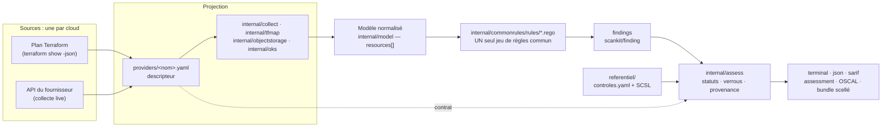

> [🇬🇧 English](architecture.md) · 🇫🇷 Français

# Architecture

Pépin lit la configuration d'un tenant cloud, l'évalue contre un référentiel commun de
contrôles, et produit un résultat **opposable** : un statut typé par contrôle, ses
références normatives exactes, et un bundle de preuve scellé. Cette page explique
comment, et surtout **pourquoi les pièces sont découpées à cet endroit-là**.

## Le pipeline



En une phrase : **la source change d'un cloud à l'autre ; tout ce qui est en aval du
modèle normalisé ne change pas.**

## Le choix : un seul jeu de règles, commun à tous les fournisseurs

Toutes les règles de posture vivent dans `internal/commonrules/rules/`, s'écrivent une
fois, et s'évaluent sur le modèle normalisé. **Aucune règle n'appartient à un
fournisseur.** Une règle lit `input.resources[]`, des types et des attributs agnostiques,
et étiquette son écart avec le fournisseur *tiré de la ressource* (`provider_of(r)`),
jamais codé en dur.

L'alternative évidente serait un jeu de règles par cloud. Il vaut la peine de dire ce
qu'elle coûte, parce que le choix n'est pas esthétique :

- **N fois la surface pour le même contrôle.** « Un security group ouvert à `0.0.0.0/0`
  sur le port 22 » devient trois règles à maintenir d'accord. Elles dérivent, et la
  dérive est silencieuse : rien n'échoue, les trois clouds cessent simplement d'être
  jugés à la même aune.
- **Des rapports incomparables.** Une posture multi-cloud n'a de sens que si un contrôle
  veut dire la *même chose* partout. Avec des règles par fournisseur, un `pass` sur le
  cloud A et un `pass` sur le cloud B sont deux affirmations différentes qui portent le
  même mot.
- **Une correction qui atterrit une fois au lieu de N.** Un faux positif corrigé dans la
  règle commune est corrigé partout. Dans l'autre montage, il est corrigé là où
  quelqu'un a pensé à regarder.
- **Le mapping normatif perd son sens.** Un contrôle se rattache à une exigence SCSL. Si
  trois règles l'implémentent différemment, laquelle l'exigence couvre-t-elle ?

Un nouveau contrôle n'est donc jamais « une règle pour le cloud X ». C'est :
**normaliser la donnée dans le descripteur, puis écrire une règle commune.** Si un
contrôle semble exiger une logique propre à un fournisseur, c'est le signal qu'il manque
une normalisation, un type, un attribut ou une dérivation, pas une seconde règle.

Le corollaire est le critère d'acceptation d'un nouveau cloud : **un descripteur, zéro
règle.** Voir [ajouter un fournisseur](../contributing/adding-a-provider.fr.md).

## Ce qui change d'un cloud à l'autre : la source

Un fournisseur est un descripteur `providers/<nom>.yaml`. Il porte tout ce qui est
spécifique : identité et faits de souveraineté, authentification, résolution des
identifiants, **spec de collecte live**, **mapping Terraform** et **contrat d'API**. Deux
sources, décrites dans le même fichier :

| Source | Ce qu'elle montre | Ce qu'elle ne peut pas montrer |
|---|---|---|
| **Plan Terraform** | l'état *planifié*, avant apply, sans aucun compte | tout ce qui est « known after apply », et tout ce qui n'est pas dans le code |
| **Collecte live** | la configuration *effective*, dérive comprise | tout ce que les identifiants ne peuvent pas lire |

Les deux ne sont pas interchangeables, et Pépin ne fait jamais semblant du contraire : la
source est consignée dans l'assessment (`run.source`), et la matrice de couverture est
calculée par source. [Plan Terraform ou scan live](../concepts/terraform-vs-live.fr.md)
détaille les vraies divergences.

L'essentiel de la projection est déclaratif. Deux collecteurs sont du code **Go**
partagé plutôt que de la spec, parce que leur protocole n'est pas « un endpoint REST qui
rend du JSON » : le stockage objet (compatible S3, `internal/objectstorage`) et le
Kubernetes managé (`internal/oks`). Ils s'activent en déclarant un endpoint dans le
descripteur.

## Le modèle normalisé

Tout ce qui est en aval voit la même forme, et seulement celle-ci :

```go
type Resource struct {
	Provider   string         `json:"provider"`
	Type       string         `json:"type"`
	ID         string         `json:"id"`
	Name       string         `json:"name"`
	Region     string         `json:"region,omitempty"`
	Attributes map[string]any `json:"attributes"`
}
```

`Type` est un type agnostique (`compute_instance`, `security_group_rule`,
`object_storage_bucket`, `managed_database`, `iam_policy`, `kubernetes_cluster`…), et les
clés d'attributs le sont aussi. Le vocabulaire natif du fournisseur s'arrête au
descripteur : il survit dans la prose qu'un rapport imprime (Net, BSU, Kapsule, EIM),
jamais dans l'évaluation.

Une règle ne se déclenche que si des ressources du type qu'elle lit existent. Un
fournisseur qui n'a pas ce type ne la déclenche tout simplement pas, et c'est pourquoi un
jeu de règles commun ne produit aucun faux positif sur un cloud dépourvu du mécanisme.

## Les trois verrous contre le faux vert

Un outil de posture échoue dans deux directions, et elles ne sont pas symétriques. Un
faux positif est bruyant, donc il se corrige. Un **faux vert est invisible par
construction**, et c'est contre lui que cette architecture est taillée. Trois verrous
séparent « aucun écart » de `pass` :

1. **La garde de capacité, dans la règle.** La règle ne lit un attribut que s'il est
   présent : une donnée non collectée ne produit jamais de faux positif.
2. **Le verrou du contrat, dans `internal/assess`.** Un `pass` n'est affirmé que si le
   contrat du fournisseur déclare le type `verifie`, c'est-à-dire lu dans le SDK et
   réellement projeté. Sinon le résultat est `not-evaluated`, avec son motif.
3. **Le verrou `requiredAttr`.** Pour les contrôles dont le silence se lirait comme une
   conformité, l'attribut décisif est déclaré dans `internal/assess`. Si aucune ressource
   du type visé ne le portait, le contrôle est `not-evaluated` plutôt que `pass`.

Les mêmes fonctions servent le scan et la documentation : `assess.Verified` est appelée
par `cmd/scan.go` **et** par le générateur de couverture, si bien qu'une page de
couverture ne peut pas décrire un verrou différent de celui qui est appliqué.
[Le modèle d'assessment](../concepts/assessment-model.fr.md) dit ce que chaque statut
affirme.

## Ce qui vient de `scankit`, et ce qui reste dans Pépin

Le moteur, le modèle de finding, le rendu et le scoring ne sont **pas** propres à Pépin :
ils sont partagés avec son outil frère via
[`github.com/stephrobert/scankit`](https://github.com/stephrobert/scankit), épinglé par
version dans `go.mod`.

| Vient de `scankit` | Reste dans Pépin |
|---|---|
| `engine` : évaluation OPA (`engine.Evaluate`) | les règles `.rego` elles-mêmes |
| `finding.Finding` : le modèle de finding, avec ses `labels` | les collecteurs et `providers/*.yaml` |
| `report` : rendus terminal, JSON, SARIF, OSCAL | `referentiel/` : le référentiel de contrôles et les mappings SCSL |
| `scoring` : comptes par sévérité | `internal/assess` : statuts, verrous, provenance, bundle scellé |
| `assessment` : les types de l'assessment | la marque, le verdict, la CLI, la couche bilingue |

La règle est simple : **toute évolution du moteur, du rendu ou du scoring se fait dans
`scankit`**, pour que les deux outils en profitent ; Pépin ne garde aucun moteur local.
C'est aussi pourquoi la sortie terminal est identique à celle de son frère.

## Le trajet d'une ressource, de bout en bout

Prenons un plan Terraform contenant un `scaleway_object_bucket_acl` avec une ACL
publique :

1. **Analyse.** `internal/tfparse` lit `terraform show -json` et en tire les ressources
   planifiées.
2. **Projection.** La section `mapping_terraform` de `providers/scaleway.yaml` transforme
   `scaleway_object_bucket_acl` en un `object_storage_bucket` normalisé portant
   l'attribut `acl`. Rien de propre au fournisseur ne survit à cette étape.
3. **Évaluation.** `engine.Evaluate` passe toutes les règles communes sur
   `input.resources[]`. `objectstorage_bucket_public_access` se déclenche et émet un
   écart avec son `code`, sa `severity`, son `subject`, son message français et son
   `labels.message_en`, plus `labels.provider` tiré de la ressource.
4. **Enrichissement.** L'écart est joint à `referentiel/controles.yaml` : exigence SCSL
   exacte, correspondances SecNumCloud / CIS / ISO, lien de documentation.
5. **Assessment.** `assess.Build` transforme les écarts en un statut typé par contrôle,
   en appliquant les trois verrous ci-dessus, et enveloppe le tout dans une provenance
   d'exécution (version de l'outil, empreinte du jeu de règles, cible, horodatage,
   source, périmètre).
6. **Rendu.** `scankit/report` imprime le rapport terminal, ou du JSON, du SARIF, de
   l'OSCAL ; le verdict et le code de sortie suivent le scoring. `--seal` écrit le bundle
   de preuve horodaté que `pepin verify` recontrôle.

Le guide de remédiation montre les étapes 5 et 6
[avant et après](../guides/remediation.fr.md) une correction, capturées par exécution
réelle.

## Les sources de vérité

Rien, dans ce projet, n'est vrai à deux endroits à la fois. Quand deux artefacts se
contredisent, ce tableau dit lequel l'emporte.

| Question | Source de vérité |
|---|---|
| Quels contrôles existent, leur sévérité et leurs correspondances normatives | `referentiel/controles.yaml` |
| Quelles exigences SCSL existent | l'index SCSL **gelé** (`framework-scsl`), reflété dans `referentiel/scsl-baseline.json` |
| Ce qu'un fournisseur collecte, mappe et a vérifié | `providers/<nom>.yaml` |
| Ce qui rend un `pass` affirmable | `internal/assess` (`Verified`, `requiredAttr`) |
| Ce que l'outil détecte | `internal/commonrules/rules/*.rego` |
| Ce que la documentation affirme de la couverture | calculé par `internal/docgen`, jamais écrit à la main |

Cette dernière ligne est un choix d'architecture elle aussi : la matrice de couverture,
le catalogue des contrôles et toutes les sorties de commande montrées dans `docs/` sont
**générés**, et `TestGeneratedDocsAreUpToDate` régénère puis compare en CI. Une page de
documentation n'est pas une source, c'est le rendu d'un calcul. Un CSPM qui ment sur ce
qu'il mesure est pire qu'un CSPM sans documentation.

## Bilingue par construction

Pépin résout une langue au démarrage, `--lang` → `PEPIN_LANG` → `LC_ALL` → `LANG` →
repli `en`, et tout ce qu'un humain lit suit : rapport, verdict, aide, erreurs, ainsi que
la prose contenue dans `json`, `sarif`, `oscal` et `assessment`. Ce qui ne change jamais
avec la langue : les codes, les identifiants de contrôle, les sévérités, les statuts, les
sujets et les codes de sortie. C'est là-dessus qu'un pipeline se branche.

Le français est la langue de référence du contenu normatif ; l'anglais en est la
traduction maintenue. `mise run validate` refuse un contrôle, une règle ou une
justification de contrat à qui il manque sa contrepartie : un rapport anglais ne doit
jamais retomber en français au milieu d'une phrase.

## Voir aussi

- [Ajouter un contrôle](../contributing/adding-a-control.fr.md) : le côté règle, de bout
  en bout.
- [Ajouter un fournisseur](../contributing/adding-a-provider.fr.md) : le côté source, de
  bout en bout.
- [Le modèle d'assessment](../concepts/assessment-model.fr.md) : ce que chaque statut
  affirme.
- [Matrice de couverture](../coverage.fr.md) : ce qui est mesurable, par fournisseur et
  par source.
- [Périmètre et non-objectifs](../concepts/scope.fr.md) : ce qu'un rapport Pépin n'est
  pas.
