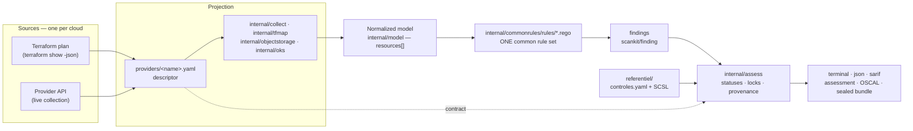

> 🇬🇧 English · [🇫🇷 Français](architecture.fr.md)

# Architecture

Pépin reads the configuration of a cloud tenant, evaluates it against a common control
reference, and produces an **opposable** result: a typed status per control, its exact
normative references, and a sealed evidence bundle. This page explains how, and — more
usefully — **why the pieces are cut where they are**.

## The pipeline



Read it in one sentence: **the source changes from one cloud to the next; everything
downstream of the normalized model does not.**

## The decision: one rule set, common to every provider

Every posture rule lives in `internal/commonrules/rules/`, is written once, and
evaluates the normalized model. **No rule belongs to a provider.** A rule reads
`input.resources[]` — agnostic types, agnostic attributes — and labels its finding with
the provider *taken from the resource* (`provider_of(r)`), never hardcoded.

The obvious alternative is one rule set per cloud. It is worth spelling out what that
costs, because the choice is not aesthetic:

- **N times the surface for the same check.** "A security group open to `0.0.0.0/0` on
  port 22" becomes three rules that must be kept in agreement. They drift, and the drift
  is silent: nothing fails, the three clouds simply stop being judged by the same
  standard.
- **Reports that cannot be compared.** A multi-cloud posture is only meaningful if a
  control means the *same thing* everywhere. With per-provider rules, `pass` on cloud A
  and `pass` on cloud B are two different claims wearing the same word.
- **A fix that lands once instead of N times.** A false positive corrected in the common
  rule is corrected everywhere. In the other design it is corrected where someone
  remembered to look.
- **The normative mapping stops making sense.** A control maps onto an SCSL requirement.
  If three rules implement it differently, which one does the requirement cover?

So a new check is never "a rule for cloud X". It is: **normalize the data in the
descriptor, then write one common rule.** If a check seems to require provider-specific
logic, that is the signal that the normalization is missing — a type, an attribute, a
derivation — not that a second rule is needed.

The corollary is the acceptance criterion for a new cloud: **one descriptor, zero
rules.** See [adding a provider](../contributing/adding-a-provider.md).

## What changes per cloud: the source

A provider is a `providers/<name>.yaml` descriptor. It carries everything that is
specific: identity and sovereignty facts, authentication, credential resolution, the
**live collection spec**, the **Terraform mapping**, and the **API contract**. Two
sources, described in the same file:

| Source | What it shows | What it cannot show |
|---|---|---|
| **Terraform plan** | the *planned* state, before apply, with no account needed | anything "known after apply", and anything not in the code |
| **Live collection** | the *effective* configuration, drift included | anything the credentials cannot read |

The two are not interchangeable, and Pépin never pretends they are: the source is
recorded in the assessment (`run.source`), and the coverage matrix is computed per
source. [Terraform plan vs live scan](../concepts/terraform-vs-live.md) goes into the
real divergences.

Most of the projection is declarative. Two collectors are shared **Go** code rather than
spec, because their protocol is not "a REST endpoint returning JSON": object storage
(S3-compatible, `internal/objectstorage`) and managed Kubernetes (`internal/oks`). They
are enabled by declaring an endpoint in the descriptor.

## The normalized model

Everything downstream sees the same shape, and only this shape:

```go
type Resource struct {
	Provider   string         `json:"provider"`
	Type       string         `json:"type"`
	ID         string         `json:"id"`
	Name       string         `json:"name"`
	Region     string         `json:"region,omitempty"`
	Attributes map[string]any `json:"attributes"`
}
```

`Type` is an agnostic type (`compute_instance`, `security_group_rule`,
`object_storage_bucket`, `managed_database`, `iam_policy`, `kubernetes_cluster`…), and
the attribute keys are agnostic too. The provider's native vocabulary stops at the
descriptor: it survives in the prose a report prints (Net, BSU, Kapsule, EIM), never in
the evaluation.

A rule only fires if resources of the type it reads exist. A provider that has no such
type simply does not trigger it — which is why a common rule set produces no false
positives on a cloud that lacks the mechanism.

## The three locks against a false green

A posture tool fails in two directions, and they are not symmetrical. A false positive
is noisy and gets fixed. A **false green is invisible by construction**, and it is the
one this architecture is shaped against. Three locks sit between "no finding" and
`pass`:

1. **The capability guard, in the rule.** The rule reads an attribute only if it is
   present, so uncollected data never produces a false positive.
2. **The contract lock, in `internal/assess`.** A `pass` is asserted only if the
   provider contract declares the type `verifie` — read in the SDK and really projected.
   Otherwise the result is `not-evaluated`, with its reason.
3. **The `requiredAttr` lock.** For controls whose silence would otherwise read as
   compliance, the deciding attribute is declared in `internal/assess`. If no resource
   of the targeted type carried it, the control is `not-evaluated` rather than `pass`.

The same functions serve the scan and the documentation: `assess.Verified` is called by
`cmd/scan.go` **and** by the coverage generator, so a coverage page cannot describe a
lock different from the one applied. [The assessment
model](../concepts/assessment-model.md) states what each status asserts.

## What comes from `scankit`, and what stays in Pépin

The engine, the finding model, the rendering and the scoring are **not** Pépin-specific:
they are shared with its sibling tool through
[`github.com/stephrobert/scankit`](https://github.com/stephrobert/scankit), pinned by
version in `go.mod`.

| Comes from `scankit` | Stays in Pépin |
|---|---|
| `engine` — OPA evaluation (`engine.Evaluate`) | the `.rego` rules themselves |
| `finding.Finding` — the finding model, with its `labels` | the collectors and `providers/*.yaml` |
| `report` — terminal, JSON, SARIF, OSCAL rendering | `referentiel/` — the control reference and SCSL mappings |
| `scoring` — severity counts | `internal/assess` — statuses, locks, provenance, sealed bundle |
| `assessment` — the assessment types | the brand, the verdict, the CLI, the bilingual layer |

The rule is: **any engine, rendering or scoring change happens in `scankit`**, so both
tools benefit; Pépin keeps no local engine. That is also why the terminal output is
identical to its sibling's.

## The journey of one resource, end to end

Take a Terraform plan containing a `scaleway_object_bucket_acl` with a public ACL:

1. **Parse.** `internal/tfparse` reads `terraform show -json` and yields the planned
   resources.
2. **Project.** The `mapping_terraform` section of `providers/scaleway.yaml` turns
   `scaleway_object_bucket_acl` into a normalized `object_storage_bucket` carrying the
   `acl` attribute. Nothing provider-specific survives past this step.
3. **Evaluate.** `engine.Evaluate` runs every common rule over
   `input.resources[]`. `objectstorage_bucket_public_access` fires, and emits a finding
   with its `code`, `severity`, `subject`, its French message and its
   `labels.message_en`, plus `labels.provider` taken from the resource.
4. **Enrich.** The finding is joined to `referentiel/controles.yaml`: exact SCSL
   requirement, SecNumCloud / CIS / ISO mappings, documentation link.
5. **Assess.** `assess.Build` turns findings into a typed status per control, applying
   the three locks above, and wraps everything in a run provenance envelope (tool
   version, ruleset digest, target, timestamp, source, scope).
6. **Render.** `scankit/report` prints the terminal report, or JSON, SARIF, OSCAL; the
   verdict and the exit code follow the scoring. `--seal` writes the timestamped
   evidence bundle that `pepin verify` re-checks.

The remediation guide shows steps 5 and 6 [before and
after](../guides/remediation.md#the-loop-measured) a fix, captured from real runs.

## Sources of truth

Nothing in this project is true in two places at once. When two artefacts disagree, this
table says which one wins.

| Question | Source of truth |
|---|---|
| Which controls exist, their severity and their normative mappings | `referentiel/controles.yaml` |
| Which SCSL requirements exist | the **frozen** SCSL index (`framework-scsl`), mirrored in `referentiel/scsl-baseline.json` |
| What a provider collects, maps, and has verified | `providers/<name>.yaml` |
| What makes a `pass` assertable | `internal/assess` (`Verified`, `requiredAttr`) |
| What the tool detects | `internal/commonrules/rules/*.rego` |
| What the documentation claims about coverage | computed by `internal/docgen`, never written by hand |

That last line is a design choice too: the coverage matrix, the control catalogue and
every command output shown in `docs/` are **generated**, and
`TestGeneratedDocsAreUpToDate` regenerates and compares in CI. A documentation page is
not a source; it is the rendering of a computation. A CSPM that lies about what it
measures is worse than one with no documentation.

## Bilingual by construction

Pépin resolves one language at startup — `--lang` → `PEPIN_LANG` → `LC_ALL` → `LANG` →
fallback `en` — and everything a human reads follows: report, verdict, help, errors, and
the prose inside `json`, `sarif`, `oscal` and `assessment`. What never changes with the
language: codes, check identifiers, severities, statuses, subjects and exit codes. A
pipeline keys on those.

French is the reference language of the normative content; English is its maintained
translation. `mise run validate` refuses a control, a rule or a contract justification
that is missing its counterpart: an English report must never fall back to French
mid-sentence.

## See also

- [Adding a control](../contributing/adding-a-control.md) — the rule side, end to end.
- [Adding a provider](../contributing/adding-a-provider.md) — the source side, end to end.
- [The assessment model](../concepts/assessment-model.md) — what each status asserts.
- [Coverage matrix](../coverage.md) — what is measurable, per provider and per source.
- [Scope and non-goals](../concepts/scope.md) — what a Pépin report is not.
